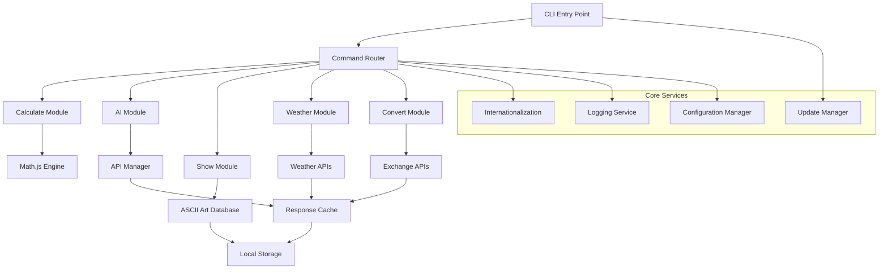

# Design Document

## Overview

The mdsaad CLI tool is architected as a modular Node.js application using the Commander.js framework for command parsing and execution. The design emphasizes offline-first functionality, graceful degradation, and extensible architecture to support the diverse feature set including mathematical calculations, AI interactions, ASCII art display, weather services, and currency conversion.

## Architecture

### High-Level Architecture



### Module Structure

```
src/
├── cli.js                 # Main CLI entry point
├── commands/              # Command implementations
│   ├── calculate.js       # Mathematical calculations
│   ├── ai.js             # AI interactions
│   ├── show.js           # ASCII art display
│   ├── weather.js        # Weather information
│   └── convert.js        # Currency/unit conversion
├── services/             # Core services
│   ├── api-manager.js    # API client management
│   ├── cache.js          # Caching service
│   ├── i18n.js           # Internationalization
│   ├── logger.js         # Logging service
│   └── config.js         # Configuration management
├── utils/                # Utility functions
│   ├── formatters.js     # Output formatting
│   ├── validators.js     # Input validation
│   └── error-handler.js  # Error handling
├── assets/               # Static assets
│   ├── ascii-art/        # ASCII art database
│   └── translations/     # Language files
└── plugins/              # Plugin system
    └── plugin-loader.js  # Plugin management
```

## Components and Interfaces

### 1. CLI Entry Point (cli.js)

**Purpose:** Main application entry point that initializes the Commander.js framework and registers all commands.

**Key Responsibilities:**
- Initialize global configuration and services
- Register command handlers with Commander.js
- Handle global flags (--lang, --verbose, --debug)
- Manage auto-update checks
- Set up error handling and logging

**Interface:**
```javascript
class CLIApplication {
  constructor()
  async initialize()
  registerCommands()
  setupGlobalMiddleware()
  handleGlobalOptions(options)
}
```

### 2. Command Modules

#### Calculate Command (commands/calculate.js)

**Purpose:** Handles mathematical calculations using math.js library with support for complex expressions, unit conversions, and step-by-step solving.

**Key Features:**
- Expression parsing and evaluation
- Scientific function support
- Unit conversion integration
- Precision control
- Verbose step-by-step output

**Interface:**
```javascript
class CalculateCommand {
  async execute(expression, options)
  parseExpression(expression)
  evaluateWithSteps(expression, verbose)
  formatResult(result, precision)
  handleUnitConversion(expression)
}
```

#### AI Command (commands/ai.js)

**Purpose:** Manages AI interactions with multiple free API providers, implementing fallback mechanisms and rate limiting.

**Key Features:**
- Multi-provider API management (Gemini, Deepseek, OpenRouter, Nvidia, Groq)
- Streaming response support
- Context management
- Rate limiting and quota tracking
- Ollama integration for offline use

**Interface:**
```javascript
class AICommand {
  async execute(prompt, options)
  selectProvider(model, availability)
  streamResponse(provider, prompt, options)
  manageContext(context, prompt)
  handleRateLimit(provider)
}
```

#### Show Command (commands/show.js)

**Purpose:** Displays ASCII art with animation, color, and customization options from a local database.

**Key Features:**
- ASCII art database management
- Animation rendering with terminal control sequences
- Color application and theming
- Dynamic width adjustment
- Search and categorization

**Interface:**
```javascript
class ShowCommand {
  async execute(artName, options)
  loadArt(artName)
  renderAnimated(frames, options)
  applyColors(art, colorScheme)
  searchArt(query)
  listCategories()
}
```

#### Weather Command (commands/weather.js)

**Purpose:** Provides weather information using free APIs with caching and fallback mechanisms.

**Key Features:**
- Multi-API support (OpenWeatherMap, WeatherAPI)
- Location resolution and auto-detection
- Detailed and summary views
- Unit preference handling
- 30-minute response caching

**Interface:**
```javascript
class WeatherCommand {
  async execute(location, options)
  resolveLocation(location)
  fetchWeatherData(location, provider)
  formatWeatherOutput(data, options)
  handleAlerts(alerts)
}
```

#### Convert Command (commands/convert.js)

**Purpose:** Handles currency and unit conversions with real-time rates and historical data support.

**Key Features:**
- Real-time exchange rate fetching
- Historical rate queries
- Unit conversion support
- Batch conversion processing
- Favorites management

**Interface:**
```javascript
class ConvertCommand {
  async execute(amount, fromUnit, toUnit, options)
  fetchExchangeRates(baseCurrency)
  convertCurrency(amount, from, to, date)
  convertUnits(amount, from, to, type)
  manageFavorites(operation, pair)
}
```

### 3. Core Services

#### API Manager (services/api-manager.js)

**Purpose:** Centralized API client management with automatic failover, rate limiting, and response caching.

**Key Features:**
- Provider registration and health monitoring
- Automatic failover between providers
- Rate limit tracking and enforcement
- Response caching with TTL
- Request/response logging

**Interface:**
```javascript
class APIManager {
  registerProvider(name, config)
  async makeRequest(provider, endpoint, params)
  handleFailover(failedProvider, request)
  checkRateLimit(provider)
  cacheResponse(key, response, ttl)
}
```

#### Cache Service (services/cache.js)

**Purpose:** Local caching system for API responses, exchange rates, and weather data to support offline functionality.

**Key Features:**
- File-based caching with JSON storage
- TTL-based expiration
- Cache size management
- Offline data serving
- Cache invalidation strategies

**Interface:**
```javascript
class CacheService {
  async get(key)
  async set(key, value, ttl)
  async invalidate(key)
  async cleanup()
  getStats()
}
```

#### Internationalization Service (services/i18n.js)

**Purpose:** Manages multi-language support with dynamic language loading and locale detection.

**Key Features:**
- Dynamic language file loading
- Locale detection and fallback
- Pluralization support
- Command translation
- Error message localization

**Interface:**
```javascript
class I18NService {
  async loadLanguage(locale)
  translate(key, params)
  detectLocale()
  getAvailableLanguages()
  translateCommand(command, locale)
}
```

## Data Models

### Configuration Model

```javascript
{
  language: "en",
  defaultPrecision: 4,
  cacheDirectory: "~/.mdsaad/cache",
  apiKeys: {
    openweather: null,
    exchangerate: null
  },
  preferences: {
    weatherUnits: "metric",
    currencyFavorites: ["USD", "EUR", "GBP"],
    colorScheme: "auto"
  },
  rateLimit: {
    ai: { requests: 10, window: 3600000 },
    weather: { requests: 1000, window: 86400000 }
  }
}
```

### Cache Entry Model

```javascript
{
  key: "weather:london:current",
  data: { /* API response */ },
  timestamp: 1640995200000,
  ttl: 1800000,
  provider: "openweathermap"
}
```

### ASCII Art Model

```javascript
{
  name: "batman",
  category: "superheroes",
  frames: ["frame1", "frame2"], // For animations
  width: 60,
  height: 20,
  colors: ["default", "blue", "rainbow"],
  tags: ["hero", "dc", "dark"]
}
```

### API Provider Model

```javascript
{
  name: "gemini",
  type: "ai",
  baseUrl: "https://generativelanguage.googleapis.com",
  rateLimit: { requests: 10, window: 3600000 },
  status: "active",
  lastError: null,
  priority: 1
}
```

## Error Handling

### Error Classification

1. **User Input Errors:** Invalid expressions, unknown commands, malformed parameters
2. **Network Errors:** API timeouts, connection failures, rate limit exceeded
3. **System Errors:** File system issues, permission problems, memory constraints
4. **Configuration Errors:** Invalid API keys, corrupted config files, missing dependencies

### Error Response Format

```javascript
{
  type: "user_input" | "network" | "system" | "configuration",
  code: "INVALID_EXPRESSION",
  message: "❌ Invalid math expression. Check your parentheses and operators.",
  suggestion: "💡 Try: mdsaad calculate '2 * (3 + 4)'",
  details: { /* Additional context for debugging */ }
}
```

### Graceful Degradation Strategy

1. **API Failures:** Automatic fallback to alternative providers
2. **Network Issues:** Use cached data when available
3. **Missing Dependencies:** Disable affected features with clear messaging
4. **Insufficient Permissions:** Suggest alternative approaches or manual steps

## Testing Strategy

### Unit Testing

- **Framework:** Jest with coverage reporting
- **Scope:** Individual command modules, services, and utilities
- **Mock Strategy:** Mock external APIs and file system operations
- **Coverage Target:** 90% code coverage for core functionality

### Integration Testing

- **API Integration:** Test with real API endpoints using test accounts
- **Command Integration:** End-to-end command execution testing
- **Cache Integration:** Verify caching behavior across different scenarios
- **Error Handling:** Test error scenarios and recovery mechanisms

### Performance Testing

- **Load Testing:** Test with large mathematical expressions and batch operations
- **Memory Testing:** Monitor memory usage during extended operations
- **Startup Time:** Ensure CLI starts quickly without unnecessary delays
- **Animation Performance:** Verify smooth ASCII art animations

### Cross-Platform Testing

- **Operating Systems:** Windows 10/11, macOS, Ubuntu LTS
- **Node.js Versions:** LTS versions (16.x, 18.x, 20.x)
- **Terminal Compatibility:** CMD, PowerShell, Bash, Zsh
- **Package Managers:** npm, yarn, pnpm installation testing

### Test Data Management

```javascript
// Test fixtures for consistent testing
const testFixtures = {
  mathExpressions: [
    { input: "2 + 2", expected: 4 },
    { input: "sqrt(16)", expected: 4 },
    { input: "sin(pi/2)", expected: 1 }
  ],
  asciiArt: {
    batman: "/* ASCII art content */",
    categories: ["superheroes", "animals", "logos"]
  },
  weatherResponses: {
    london: { /* Mock weather data */ },
    errors: { /* Error scenarios */ }
  }
};
```

### Continuous Integration

- **GitHub Actions:** Automated testing on push and pull requests
- **Multi-platform Testing:** Parallel testing across different OS/Node.js combinations
- **Dependency Security:** Regular security audits with npm audit
- **Performance Regression:** Benchmark testing to detect performance degradation

## Security Considerations

### API Key Management

- Store API keys in user configuration files with appropriate permissions
- Never log or expose API keys in error messages
- Provide clear instructions for API key setup and rotation
- Support environment variable configuration for CI/CD environments

### Input Validation

- Sanitize all user inputs before processing
- Validate mathematical expressions to prevent code injection
- Limit input size to prevent memory exhaustion
- Escape special characters in shell commands

### Network Security

- Use HTTPS for all API communications
- Implement request timeouts to prevent hanging connections
- Validate SSL certificates for API endpoints
- Rate limit outgoing requests to prevent abuse

### File System Security

- Restrict file operations to designated cache and config directories
- Validate file paths to prevent directory traversal attacks
- Set appropriate file permissions for cache and config files
- Handle file system errors gracefully without exposing system information